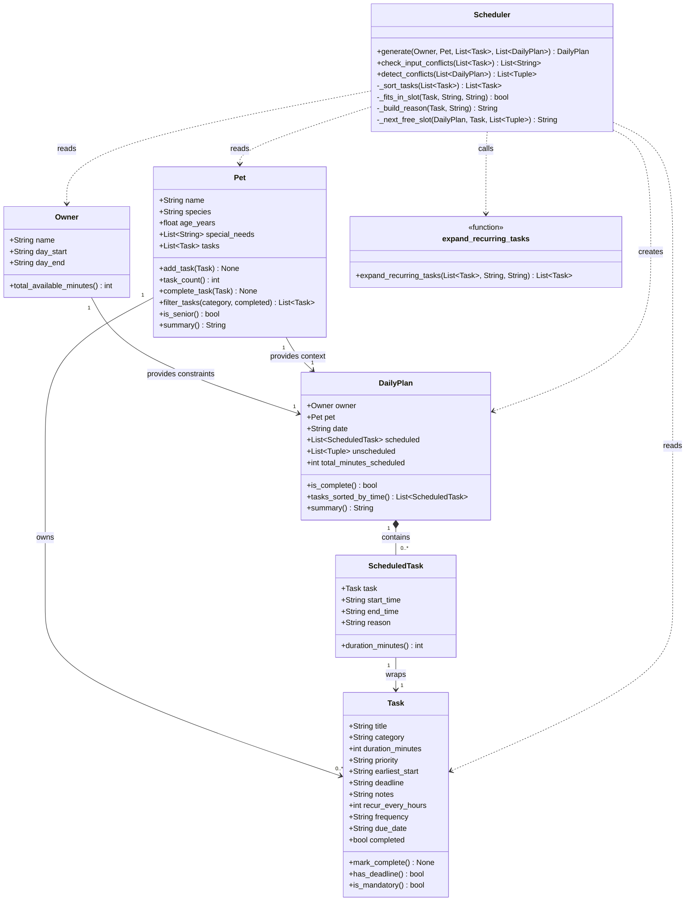

# PawPal+ Project Reflection

## 1. System Design

**Core user actions**

1. **Register their pet and profile** — Enter owner name, daily time window, and pet details (name, species, age, special needs).
2. **Add and manage care tasks** — Create tasks with duration, priority, and optional time constraints. Edit or delete tasks as the routine changes.
3. **Generate and review today's schedule** — Trigger the scheduler to produce a prioritised daily plan with a reason for each placement.

**a. Initial design**

Six classes across two layers: data layer (`Owner`, `Pet`, `Task`, `ScheduledTask`, `DailyPlan`) using Python dataclasses, and a logic layer (`Scheduler`) with a single public method `generate() -> DailyPlan`. The UI (`app.py`) is kept thin — it calls the scheduler and renders results; no scheduling logic lives there.

**b. Design changes**

1. **Removed `Owner.available_minutes`** — it could silently conflict with `day_start`/`day_end`. `total_available_minutes()` now derives the value directly from the time window.
2. **`_next_free_slot(plan, int)` → `_next_free_slot(plan, task)`** — passing a bare integer meant `earliest_start` constraints were ignored. Passing the full `Task` enforces both duration and earliest-start.
3. **`unscheduled: list[Task]` → `list[tuple[Task, str]]`** — a plain task list gave no explanation for why a task was dropped. Adding a reason string lets the UI show a clear message per skipped task.

---

## 2. Scheduling Logic and Tradeoffs

**a. Constraints and priorities**

The scheduler applies four constraints in this order:

1. **Hard deadlines** — deadline tasks are placed first, sorted earliest-deadline-first.
2. **Priority level** — critical > high > medium > low. Flexible task ties broken by duration (shorter first).
3. **Earliest-start** — a task with `earliest_start="17:00"` is never placed before that time.
4. **Owner's time budget** — `day_start` to `day_end` is the hard boundary; tasks that don't fit go to `unscheduled` with a reason.

Deadlines outrank priority because missing a medication has real health consequences; a grooming task at the wrong time is just inconvenient.

**b. Tradeoffs**

**Tradeoff 1 — Greedy first-fit vs. optimal placement**

The scheduler uses greedy first-fit: sort once, place left to right into the first available gap. It always produces a valid schedule but not the optimal one — a short low-priority task can block a slot a later high-priority task needed. An optimal solver (e.g. OR-Tools) would fix this but is far more complex. Greedy is the right call: day windows are large relative to task durations, and a predictable schedule beats an opaque optimal one.

**Tradeoff 2 — Single composite sort key vs. two-group split**

The original `_sort_tasks` split tasks into mandatory and flexible groups, sorted each separately, then concatenated. The final version uses one `sorted()` call with a 4-tuple key `(group, deadline, priority_value, duration)`.

The split version made the two sort rules visually obvious. The single-sort version is shorter and easier to extend, but requires understanding that `float("inf")` is the sentinel that pushes flexible tasks after mandatory ones. Single-sort was chosen because the named `sort_key` function is self-documenting and future changes only touch one place.

---

## 3. AI Collaboration

**a. How you used AI**

I worked exclusively with **Claude** via Claude Code. I used a `.claude/agents/` setup with three specialist roles — `planner`, `coder`, and `reviewer` — each scoped to a specific type of task.

- **Design**: the planner agent reviewed the UML and caught the `_next_free_slot(plan, int)` signature problem before any code was written.
- **Implementation**: the coder agent handled bounded tasks ("rewrite `_sort_tasks` with a single `sorted()` call"), which I then reviewed and refined.
- **Debugging**: narrow, specific prompts worked best — "this `_parse_time` call crashes on '7', what is wrong?" Broad prompts produced rewrites that discarded intentional design decisions.

Most effective prompt pattern: **context + constraint + question**.

**b. Judgment and verification**

Claude suggested auto-spawning a new `Task` every time a recurring task was marked complete. It seemed intuitive but caused silent task duplication — the list would grow on every checkbox tick with no way for the owner to control it.

I rejected it and switched to `due_date` filtering: tasks for future dates exist in the list but only appear when the date picker reaches that day. Completing a task just marks it done — nothing spawns. The test `test_complete_task_does_not_spawn_new_task` confirmed the redesign was correct.

**c. Claude agent roles and session strategy**

The `.claude/agents/` directory kept three roles separate:

1. **`planner`** — design review and architectural decisions, never writing code.
2. **`coder`** — implementation against a spec I had already defined.
3. **`reviewer`** — auditing output for correctness and boundary violations (`pawpal_system.py` vs `app.py`).

Separate agents meant no early design assumptions leaked into later implementation. Each handoff forced me to re-read my own code, which caught inconsistencies early.

---

## 4. Testing and Verification

**a. What you tested**

1. **Task completion** — `mark_complete` sets `completed=True`; downstream features (filtering, strikethrough) depend on this being correct.
2. **Task addition** — `add_task` stores the right object and increments `task_count`.
3. **Sorting** — tasks added out of order still come back chronologically; critical tasks always appear before flexible ones.
4. **Recurrence** — completing a daily task marks it done without spawning a duplicate; `task_count` stays at 1.
5. **Conflict detection** — overlapping cross-pet slots are flagged; non-overlapping are not; `existing_plans` eliminates double-booking.

These behaviours fail silently — a wrong order or a missed conflict won't raise an exception. Only explicit assertions catch them.

**b. Confidence**

⭐⭐⭐⭐ (4 / 5)

All 11 tests pass. The gap is untested edge cases: day window shorter than a single task, `earliest_start` after `day_end`, all tasks with tight deadlines that prevent any from fitting. The code handles these defensively (tasks land in `unscheduled` with a reason) but they aren't verified by tests yet.

---

## 5. Reflection

**a. What went well**

The two-layer architecture. All scheduling logic lives in `pawpal_system.py`; `app.py` only calls methods and renders results. Every change stayed clean — adding cross-pet conflict avoidance touched three UI lines; removing auto-spawn recurrence touched only `mark_complete()` and `complete_task()`. A clear boundary made the system easy to change.

**b. What you would improve**

Recurring tasks still require a stored copy per date. A better design is a **recurrence rule** on `Task` that `expand_recurring_tasks` uses to generate virtual instances for any given date — no manual copies needed.

**c. Key takeaway**

**AI makes a great implementer but a poor architect.** It produces working code for whatever interface you describe, but won't protect design decisions from the next prompt. Vague requests like "fix my scheduler" returned rewrites that violated boundaries I had set. The discipline is giving Claude a bounded task with explicit constraints, then reviewing every output before accepting it.
