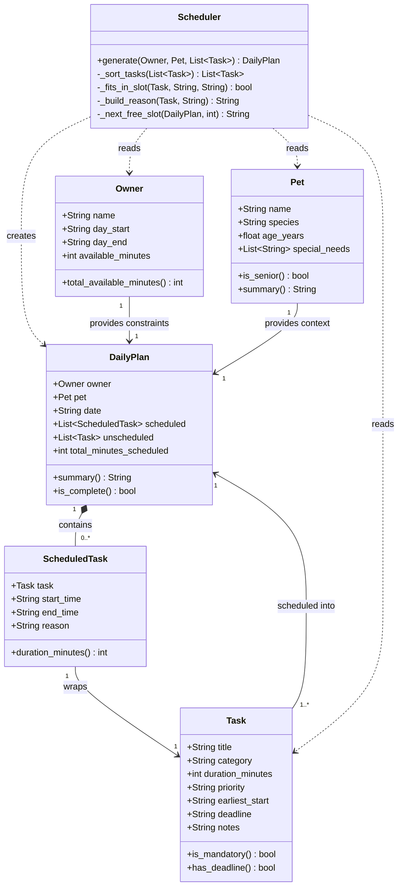

# PawPal+ Project Reflection

## 1. System Design

**Core user actions**

Three things a user needs to be able to do in PawPal+:

1. **Register their pet and profile** — The user enters basic information about themselves (name, available hours in the day) and their pet (name, species, age, any special needs). This gives the scheduler the context it needs to make sensible decisions — a senior dog with mobility issues requires different task prioritization than a healthy kitten.

2. **Add and manage care tasks** — The user creates tasks such as morning walk, evening feeding, or a medication dose, each with a duration, priority level, and optional time constraints (earliest start time or hard deadline). They should also be able to edit or remove tasks as their pet's routine changes day to day.

3. **Generate and review today's schedule** — The user triggers the scheduler to produce an ordered daily plan that fits within their available time window. The app displays each task with its assigned time slot and a plain-English reason for why it was placed there, so the owner understands the plan and can trust it — or override it.

**a. Initial design**

The system has six classes across two layers. The data layer uses Python dataclasses: `Owner` (name, daily time window), `Pet` (name, species, age, special needs), `Task` (title, category, duration, priority, optional earliest-start and deadline), `ScheduledTask` (wraps a Task with an assigned time slot and reason string), and `DailyPlan` (the output artifact — ordered scheduled list plus any tasks that couldn't fit). The logic layer has one regular class: `Scheduler`, which exposes a single public method `generate(owner, pet, tasks) -> DailyPlan` and keeps all algorithm details in private helpers. The UI (`app.py`) is intentionally kept thin — it only calls `Scheduler.generate()` and reads `DailyPlan`; no scheduling logic lives there.

**b. Design changes**

After reviewing the skeleton, three problems were identified and fixed:

1. **Removed `Owner.available_minutes`** — the original design had both an explicit `available_minutes` field *and* `day_start`/`day_end` on `Owner`. These two could silently conflict (e.g., `available_minutes=300` but the window is only 240 minutes). The field was removed; `total_available_minutes()` now derives the value directly from the time window, making `Owner` the single source of truth.

2. **Changed `_next_free_slot(plan, duration_minutes)` → `_next_free_slot(plan, task)`** — passing only a bare integer meant the helper had no way to respect a task's `earliest_start` constraint. A medication due after 2pm could have been placed at 9am. Passing the full `Task` object gives the helper everything it needs to enforce both the duration and the earliest-start boundary.

3. **Changed `unscheduled: list[Task]` → `list[tuple[Task, str]]`** — a plain list of tasks loses all context about *why* each task was dropped. The user would see tasks missing from their schedule with no explanation. Adding a reason string to every unscheduled entry means the UI can surface a clear message like "Evening walk skipped — only 5 minutes remaining in your day".

---

## 2. Scheduling Logic and Tradeoffs

**a. Constraints and priorities**

The scheduler considers four constraints, in this priority order:

1. **Hard deadlines** — a medication due by 08:30 must finish before 08:30, full stop. Deadline tasks are placed first, sorted earliest-deadline-first, so the tightest windows are filled before anything else.
2. **Priority level** — critical > high > medium > low. Within the mandatory group (deadline or critical), ties are broken by deadline time. Within the flexible group, ties are broken by duration (shorter tasks first, to maximise the number of tasks that fit).
3. **Earliest-start constraints** — a task pinned to `earliest_start="17:00"` will never be placed before that time, even if a slot opens up earlier. This models real-world constraints like "dinner feeding only in the evening."
4. **Owner's daily time budget** — the window from `day_start` to `day_end` is the hard outer boundary. Tasks that cannot fit are recorded in `DailyPlan.unscheduled` with a reason rather than silently dropped.

Deadlines were prioritised above priority level because missing a medication deadline has real consequences (a pet's health), whereas placing a low-priority grooming task at the wrong time of day is merely inconvenient.

**b. Tradeoffs**

**Tradeoff 1 — Greedy first-fit vs. optimal placement**

The scheduler uses a **greedy first-fit algorithm**: tasks are sorted once by priority/deadline, then placed into the first available gap in the timeline, left to right. This always produces a valid, non-overlapping schedule — but not the *optimal* one. A lower-priority short task can fill a gap that a later higher-priority task would have fit perfectly, pushing that task to a worse slot. A true optimal solver (e.g., OR-Tools constraint programming) would guarantee the best placement but is far more complex to implement and explain to a non-technical owner. Greedy is the right call here: day windows are long relative to task durations, greedy rarely misses, and a predictable schedule beats an opaque optimal one.

**Tradeoff 2 — Single composite sort key vs. explicit two-group split**

When refining `_sort_tasks`, two approaches were evaluated. The original split tasks into a mandatory group and a flexible group, sorted each with its own `sort()` call, then concatenated. The suggested Pythonic rewrite collapses this into a single `sorted()` with a named `sort_key(t)` function returning a 4-tuple: `(group, deadline, priority_value, duration)`.

The tradeoff: the split version makes the two different sort rules visually distinct — a reader can see immediately that mandatory tasks sort by deadline while flexible tasks sort by priority+duration. The single-sort version is shorter and easier to extend (add a new criterion by adding one tuple position), but a reader must understand that `float("inf")` as the deadline value for flexible tasks is what makes the two groups behave differently within one unified key.

Decision: the single-sort was adopted because the `sort_key` function with a comment on each line is self-documenting, the explicit `float("inf")` sentinel is a standard Python idiom for "sort last," and future changes only require editing one function instead of two separate `sort()` calls. The two-group version's apparent clarity was surface-level — it hid the fact that flexible tasks silently inherited deadline=∞.

---

## 3. AI Collaboration

**a. How you used AI**

- How did you use AI tools during this project (for example: design brainstorming, debugging, refactoring)?
- What kinds of prompts or questions were most helpful?

**b. Judgment and verification**

- Describe one moment where you did not accept an AI suggestion as-is.
- How did you evaluate or verify what the AI suggested?

---

## 4. Testing and Verification

**a. What you tested**

- What behaviors did you test?
- Why were these tests important?

**b. Confidence**

- How confident are you that your scheduler works correctly?
- What edge cases would you test next if you had more time?

---

## 5. Reflection

**a. What went well**

- What part of this project are you most satisfied with?

**b. What you would improve**

- If you had another iteration, what would you improve or redesign?

**c. Key takeaway**

- What is one important thing you learned about designing systems or working with AI on this project?
