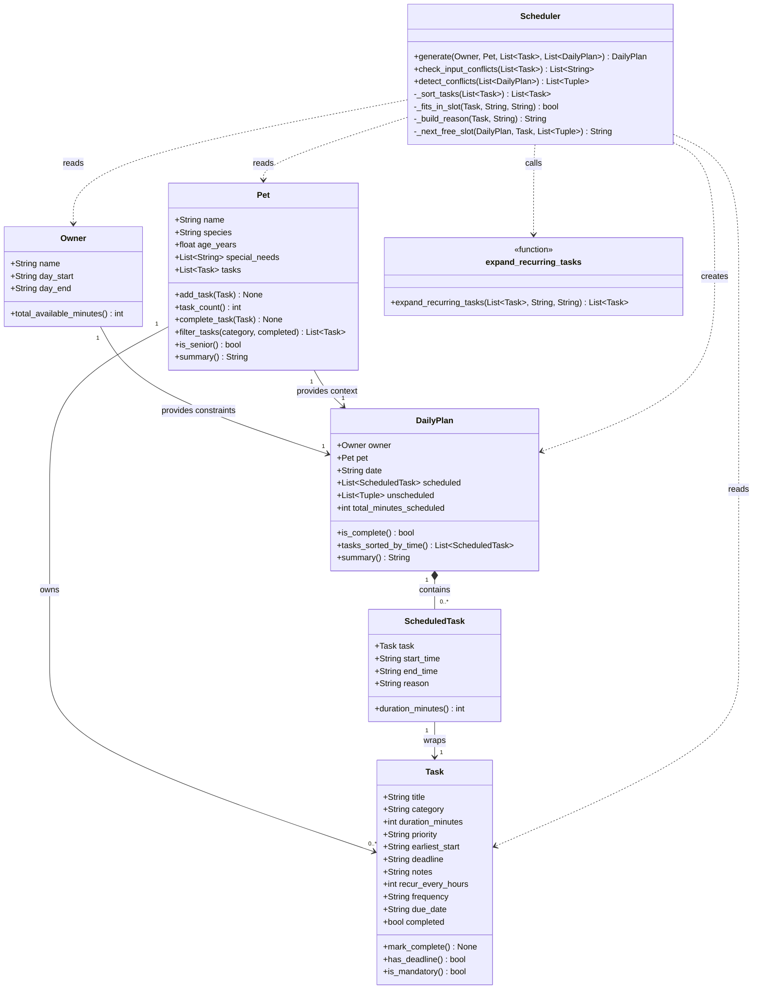

# PawPal+ Project Reflection

## 1. System Design

**Core user actions**

Three things a user needs to be able to do in PawPal+:

1. **Register their pet and profile** — The user enters basic information about themselves (name, available hours in the day) and their pet (name, species, age, any special needs). This gives the scheduler the context it needs to make sensible decisions — a senior dog with mobility issues requires different task prioritization than a healthy kitten.

2. **Add and manage care tasks** — The user creates tasks such as morning walk, evening feeding, or a medication dose, each with a duration, priority level, and optional time constraints (earliest start time or hard deadline). They should also be able to edit or remove tasks as their pet's routine changes day to day.

3. **Generate and review today's schedule** — The user triggers the scheduler to produce an ordered daily plan that fits within their available time window. The app displays each task with its assigned time slot and a plain-English reason for why it was placed there, so the owner understands the plan and can trust it — or override it.

**a. Initial design**

The system has six classes across two layers. The data layer uses Python dataclasses: `Owner` (name, daily time window), `Pet` (name, species, age, special needs), `Task` (title, category, duration, priority, optional earliest-start and deadline), `ScheduledTask` (wraps a Task with an assigned time slot and reason string), and `DailyPlan` (the output artifact — ordered scheduled list plus any tasks that couldn't fit). The logic layer has one regular class: `Scheduler`, which exposes a single public method `generate(owner, pet, tasks) -> DailyPlan` and keeps all algorithm details in private helpers. The UI (`app.py`) is intentionally kept thin — it only calls `Scheduler.generate()` and reads `DailyPlan`; no scheduling logic lives there.

**b. Design changes**

After reviewing the skeleton, three problems were identified and fixed:

1. **Removed `Owner.available_minutes`** — the original design had both an explicit `available_minutes` field *and* `day_start`/`day_end` on `Owner`. These two could silently conflict (e.g., `available_minutes=300` but the window is only 240 minutes). The field was removed; `total_available_minutes()` now derives the value directly from the time window, making `Owner` the single source of truth.

2. **Changed `_next_free_slot(plan, duration_minutes)` → `_next_free_slot(plan, task)`** — passing only a bare integer meant the helper had no way to respect a task's `earliest_start` constraint. A medication due after 2pm could have been placed at 9am. Passing the full `Task` object gives the helper everything it needs to enforce both the duration and the earliest-start boundary.

3. **Changed `unscheduled: list[Task]` → `list[tuple[Task, str]]`** — a plain list of tasks loses all context about *why* each task was dropped. The user would see tasks missing from their schedule with no explanation. Adding a reason string to every unscheduled entry means the UI can surface a clear message like "Evening walk skipped — only 5 minutes remaining in your day".

---

## 2. Scheduling Logic and Tradeoffs

**a. Constraints and priorities**

The scheduler considers four constraints, in this priority order:

1. **Hard deadlines** — a medication due by 08:30 must finish before 08:30, full stop. Deadline tasks are placed first, sorted earliest-deadline-first, so the tightest windows are filled before anything else.
2. **Priority level** — critical > high > medium > low. Within the mandatory group (deadline or critical), ties are broken by deadline time. Within the flexible group, ties are broken by duration (shorter tasks first, to maximise the number of tasks that fit).
3. **Earliest-start constraints** — a task pinned to `earliest_start="17:00"` will never be placed before that time, even if a slot opens up earlier. This models real-world constraints like "dinner feeding only in the evening."
4. **Owner's daily time budget** — the window from `day_start` to `day_end` is the hard outer boundary. Tasks that cannot fit are recorded in `DailyPlan.unscheduled` with a reason rather than silently dropped.

Deadlines were prioritised above priority level because missing a medication deadline has real consequences (a pet's health), whereas placing a low-priority grooming task at the wrong time of day is merely inconvenient.

**b. Tradeoffs**

**Tradeoff 1 — Greedy first-fit vs. optimal placement**

The scheduler uses a **greedy first-fit algorithm**: tasks are sorted once by priority/deadline, then placed into the first available gap in the timeline, left to right. This always produces a valid, non-overlapping schedule — but not the *optimal* one. A lower-priority short task can fill a gap that a later higher-priority task would have fit perfectly, pushing that task to a worse slot. A true optimal solver (e.g., OR-Tools constraint programming) would guarantee the best placement but is far more complex to implement and explain to a non-technical owner. Greedy is the right call here: day windows are long relative to task durations, greedy rarely misses, and a predictable schedule beats an opaque optimal one.

**Tradeoff 2 — Single composite sort key vs. explicit two-group split**

When refining `_sort_tasks`, two approaches were evaluated. The original split tasks into a mandatory group and a flexible group, sorted each with its own `sort()` call, then concatenated. The suggested Pythonic rewrite collapses this into a single `sorted()` with a named `sort_key(t)` function returning a 4-tuple: `(group, deadline, priority_value, duration)`.

The tradeoff: the split version makes the two different sort rules visually distinct — a reader can see immediately that mandatory tasks sort by deadline while flexible tasks sort by priority+duration. The single-sort version is shorter and easier to extend (add a new criterion by adding one tuple position), but a reader must understand that `float("inf")` as the deadline value for flexible tasks is what makes the two groups behave differently within one unified key.

Decision: the single-sort was adopted because the `sort_key` function with a comment on each line is self-documenting, the explicit `float("inf")` sentinel is a standard Python idiom for "sort last," and future changes only require editing one function instead of two separate `sort()` calls. The two-group version's apparent clarity was surface-level — it hid the fact that flexible tasks silently inherited deadline=∞.

---

## 3. AI Collaboration

**a. How you used AI**

AI was used across every phase of the project, but the role it played shifted as the work progressed.

During **design**, I used Copilot Chat with `#file:pawpal_system.py` to pressure-test the initial UML — asking "do you see any missing relationships or logic bottlenecks?" This surfaced the `_next_free_slot(plan, int)` signature problem early, before any real code existed, which saved a painful refactor later.

During **implementation**, Inline Chat on specific methods was the most productive feature. Asking "rewrite `_sort_tasks` using a single `sorted()` call with a named key function" produced idiomatic Python that I could read and reason about line by line. For the conflict detection method, I used Edit Mode to scaffold `detect_conflicts` and then refined it by hand once I understood the interval-overlap math.

During **debugging**, the most useful prompts were narrow and specific: "this `_parse_time` call crashes on the string '7' — what is wrong with my split logic?" Broad prompts like "fix my scheduler" produced unhelpful rewrites that discarded design decisions I had made intentionally.

The most effective prompt pattern throughout was: **context + constraint + question**. For example: "In `Scheduler.generate()`, I want to avoid cross-pet double-booking without changing the public API — what is the minimal change to `_next_free_slot` to support a list of already-blocked intervals?"

**b. Judgment and verification**

The clearest moment of rejection was when AI suggested auto-spawning a new `Task` object every time a recurring task was marked complete. The suggestion felt intuitive — "daily task done → create tomorrow's copy" — but it created a real problem: the task list would grow every time the app reloaded and the user checked a box. Tasks would duplicate silently with no way for the owner to see or control it.

I rejected it and redesigned the recurrence model around `due_date` filtering instead. Tasks for future dates already exist in the list; they just don't appear until the date picker reaches that day. Completing today's task marks it done — nothing spawns. This is simpler, more transparent, and easier to test: `task_count` stays at 1 after completion, which is a clean assertion.

I verified the AI suggestion was wrong by running `test_complete_task_does_not_spawn_new_task` — the test failed with the auto-spawn version and passed after the redesign, confirming the behaviour was what I intended.

**c. Copilot features and session strategy**

The three Copilot features that delivered the most value were:

1. **Inline Chat on a specific method** — keeping the scope narrow meant suggestions were targeted and easy to accept or reject with full understanding.
2. **`#file:` context in Chat** — asking questions grounded in the actual file prevented AI from hallucinating method signatures or field names that didn't exist.
3. **Edit Mode for boilerplate-heavy sections** — generating the `st.form` layout in `app.py` and the pytest function stubs saved significant repetitive typing without requiring trust in any logic.

Using separate chat sessions for each phase (design, implementation, testing, UI) helped because each session started with a clean context. There was no risk of an early design conversation's assumptions contaminating later implementation suggestions. It also forced me to re-read my own code before starting each session, which caught inconsistencies that I would have missed if I had stayed in one continuous conversation.

The key discipline was treating each AI session as a **scoped consultation**, not an open-ended delegation. I defined what I wanted, reviewed every suggestion against the existing design, and wrote the final version myself.

---

## 4. Testing and Verification

**a. What you tested**

The test suite covers five behaviour groups chosen because they represent the most likely failure points in the system:

1. **Task completion** (`mark_complete`, `complete_task`) — the most basic state change in the app. If this is wrong, every downstream feature (filtering by status, recurring tasks, UI strikethrough) breaks silently.
2. **Task addition** (`add_task`, `task_count`) — verifies the `Pet` data layer stores and counts tasks correctly. A regression here would corrupt every schedule.
3. **Sorting correctness** (`tasks_sorted_by_time`, `_sort_tasks`) — the scheduler's entire value proposition is correct ordering. Tests add tasks out of order on purpose to prove the sort is real, not an accident of insertion order.
4. **Recurrence** — tests confirm that completing a daily task marks it done without spawning a duplicate, and that `task_count` stays at 1. This directly guards the design decision to use `due_date` filtering rather than auto-spawning.
5. **Conflict detection** (`detect_conflicts`, `generate(existing_plans=…)`) — three tests cover the full spectrum: conflicts are flagged when tasks overlap, not flagged when they don't, and eliminated entirely when `existing_plans` is passed to `generate()`.

These tests were important because they are the behaviours most likely to break silently — a schedule that looks correct to the eye but has tasks in the wrong order, or a conflict that isn't caught, would not raise an exception. Only an explicit assertion catches it.

**b. Confidence**

⭐⭐⭐⭐ (4 / 5)

All 11 tests pass and cover the critical paths. The gap is edge-case coverage: an owner's day window shorter than a single task's duration, a task whose `earliest_start` is after `day_end`, and a task list where every task has a tight deadline that prevents any from fitting. These are handled defensively in the code — unscheduled tasks land in `DailyPlan.unscheduled` with a reason — but are not verified by automated tests. Adding those three tests would raise confidence to 5/5.

---

## 5. Reflection

**a. What went well**

The part of the project I am most satisfied with is the two-layer architecture: all scheduling logic lives in `pawpal_system.py` and the UI in `app.py` is genuinely thin — it calls methods and renders results, with zero scheduling logic of its own. This made every improvement clean. When cross-pet conflict avoidance was needed, I added `existing_plans` to `Scheduler.generate()` and the UI change was three lines. When the auto-spawn recurrence design was wrong, removing it required touching only `mark_complete()` and `complete_task()` — the UI checkbox handler needed no change at all. A clean boundary made the system resilient to design changes.

**b. What you would improve**

The date-picker approach to recurring tasks is correct but incomplete. Currently, a task with `frequency="daily"` only appears on its specific `due_date`. For truly recurring tasks — ones the owner expects to see every day without manually creating a copy per day — the right design is a **recurrence rule** that generates task instances on the fly during schedule generation rather than requiring a stored copy per date. I would redesign `expand_recurring_tasks` to accept a date and produce virtual copies for that day from a single stored rule.

**c. Key takeaway**

The most important thing I learned is that **AI makes a great junior implementer but a poor architect**. It will produce working code for whatever interface you describe — but it will not protect your design decisions from the next prompt. When I asked for a "fix" without constraining the scope, suggestions routinely violated boundaries I had already established (adding logic to `app.py` that belonged in `pawpal_system.py`, auto-spawning tasks that should have been filtered). Staying in the role of lead architect meant writing down the design constraints first, giving AI a bounded task, and reviewing every output against those constraints before accepting it. The discipline is not in using AI less — it is in directing it precisely.
